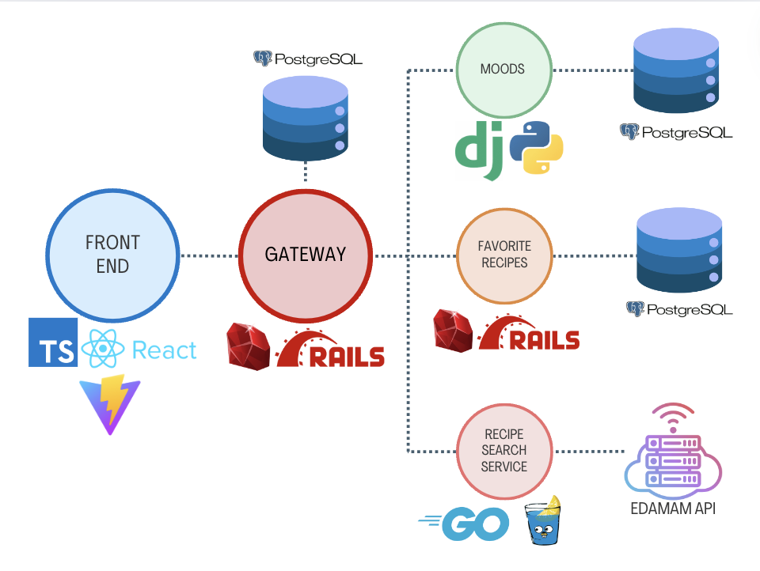

</br>

# User Mood Api
- This is a microservice for the Brain Food Organization. It's sole purpose is to store and return mood information about the users.

## Technologies
[](https://rubyonrails.org/) [](https://rubyonrails.org/) [](https://www.postgresql.org/)  [](https://www.djangoproject.com/)      [](https://dl.circleci.com/status-badge/redirect/gh/Moody-Foodies/user_moods_django/tree/main)

## Table of Contents
- [Prerequisites](#prerequisites)
- [Installation](#installation)
- [Running the Server](#running-the-server)
- [Running Tests](#running-tests)
- [API Endpoints](#api-endpoints)
  - [Get Moods](#get-moods)
  - [Post Mood](#post-mood)
- [Architecture](#architecture)
  - [Repositories](#repositories)
- [Schema](#schema)
- [Contributors](#contributors)
- [Contributing](#contributing)
- [License](#license)

## Prerequisites
- Python 3.12.3
- pip, version 24.0
- PostgreSQL
- virtualenv

## Installation
1) Clone the Repository
```Bash
git clone <repository_url>
```

2) Navigate to the project directory:
```Bash
cd django_mood_api
```

3) Create a virtual environment:
```Bash
python3 -m venv venv
```

4) Activate the virtual environment:
- On macOS/Linux:
```Bash
source venv/bin/activate
```

- On Windows:
```Bash
venv\scripts\activate
```

5) Install the dependencies:
```Bash
pip install -r requirements.txt
```

6) Set up environments variables:
  - Create a `.env` file in the project root and add the following:
```Bash
DJANGO_SECRET_KEY=your-very-secret-key
```

Contact for secret key.

7) Apply migrations:
```Bash
python manage.py migrate
```

## Running the Server
1) Start the development server:
```Bash
python manage.py runserver
```
2) Open your browser and navigate to `http://127.0.0.1:8000`.

## Running Tests
```Bash
python manage.py test
```

## API Endpoints
### Get Moods

**URL:** `/api/moods/`

**Method:** `GET`

**Query Parameters:**

- `user_id` (required): The ID of the user to get moods for.

**Response:**

```json
{
  "data": {
    "id": "1",
    "type": "moods",
    "attributes": {
      "avg_mood": 3.5,
      "user_moods": [
        {"date": "2024-05-01", "mood": 4},
        {"date": "2024-05-02", "mood": 3}
      ]
    }
  }
}
```
**Example Request:**
```Bash 
GET "http://127.0.0.1:8000/api/moods/?user_id=1"
```

### Post Mood

**URL:** `/api/moods/`

**Method:** `POST`

**Request Body:**

```json
{
  "user_id": 1,
  "mood": 4
}

```
**Response:**
```json 
{
  "user_id": 1,
  "mood": 4,
  "date": "2024-05-23"
}
```
**Example Request:**
```Bash
curl -X POST "http://127.0.0.1:8000/api/moods/" -H "Content-Type: application/json" -d '{"user_id": 1, "mood": 4}'
```

# Architecture:
## Architecture: 
</br>


Brain Food utilizes a contemporary micro-service architecture for a performant and scalable experience.

- Frontend: Built with React, a JavaScript library for constructing interactive UIs. This enables a clean and responsive user experience.
- API Gateway: Implemented in Ruby on Rails. Routes incoming API requests to the appropriate backend service, promoting separation of concerns and maintainability, based on predefined rules. Stores Users and Nutrients
- Mood Backend Services: Stores and calculates average of mood for a user. 
- Favorite Recipes Backend Services: Stores recipes user saved. 
- Recipe Search Service: Golang and Gin Framework. The application can interact with external API "EDAMAM API", enabling access to external data sources and functionalities without reinventing the wheel.
- Database: PostgreSQL serves as the database management system, ensuring secure and reliable data persistence.

In essence, this architecture employs a clear separation between the frontend (React) and backend (Micro-services), with an API Gateway for routing and PostgreSQL for data storage. The integration with external APIs fosters a more extensible application.

### Repositories:
- [Front End](https://github.com/Moody-Foodies/moody-foodies-fe)
- [Mood Service](https://github.com/Moody-Foodies/user_moods_django)
- [Favorite Recipes Service](https://github.com/Moody-Foodies/favorited-recipes-service)
- [Recipe Search Service](https://github.com/Moody-Foodies/recipes-service-be)

## Schema:


## Contributors
- [Erin Kelley](https://github.com/kelleyej) - [LinkedIn](https://www.linkedin.com/in/kelleyej/)
- [Faisal Nazari](https://github.com/mfaisalnazari) - [LinkedIn](https://www.linkedin.com/in/mfaisalnazari/)
- [Igor Magalhaes](https://github.com/IgorrMagalhaess) - [LinkedIn](https://www.linkedin.com/in/igorrmagalhaess/)
- [Jack Sweeney](https://github.com/JackCSweeney) - [LinkedIn](https://www.linkedin.com/in/jack-sweeney-024043274/)
- [Laura Long](https://github.com/lalonggone) - [LinkedIn](https://www.linkedin.com/in/lauralonggone/)

## Contributing
Contributions are welcome! Feel free to open issues or pull requests.

## License
This project is licensed under the [MIT License](./LICENSE).